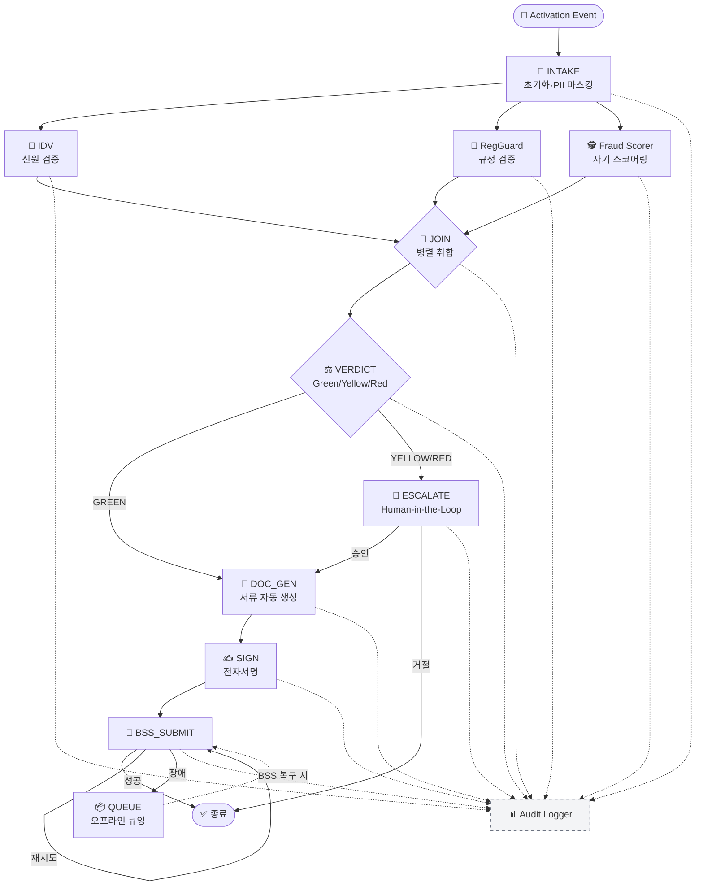

# 2. LangGraph 그래프 설계

> 노드·엣지·State 스키마·체크포인트 정의.
> 근거: `references/05-mas-langgraph.md` §3 "노드·엣지·State 설계 패턴"

---

## State 스키마

```python
class ActivationState(TypedDict):
    # === 입력 ===
    request_id: str
    activation_type: Literal["NEW", "MNP", "CORP", "FOREIGNER"]
    dealer_id: str
    agent_id: str  # 영업사원 ID
    customer_inputs: dict  # 신분증 이미지(path), 셀피(path), 기본 정보(마스킹 전)

    # === 검증 결과 (병렬 노드 출력) ===
    idv_result: Optional[IDVResult]      # PASS/FAIL + 신뢰도 + bbox
    reg_result: Optional[RegResult]      # PASS/WARN/FAIL + 인용 조항
    fraud_result: Optional[FraudResult]  # 0~1 + features + 유사사례

    # === 종합 판정 ===
    verdict: Optional[Literal["GREEN", "YELLOW", "RED"]]
    verdict_reasons: list[str]  # 근거 리스트 (사람이 읽을 수 있는 형식)

    # === 사용자 행위 ===
    user_confirm: Optional[dict]  # 영업사원/점장/리스크팀 수동 확인 이력
    escalation_path: Optional[Literal["MANAGER", "RISK_TEAM"]]

    # === 서류·제출 ===
    docs: Optional[DocsResult]      # PDF 경로 + 서명 상태
    bss_result: Optional[BSSResult] # 접수번호 + 예상 시각 or 에러

    # === 메타 ===
    started_at: datetime
    checkpoints: list[str]  # 통과 단계
    errors: list[dict]      # 단계별 에러 기록
```

### State 불변식 (Invariants)
- `verdict`는 `idv_result · reg_result · fraud_result` 3개 모두 채워진 후에만 설정됨
- `bss_result`는 `verdict = GREEN` 또는 `escalation_path` 승인 후에만 설정됨
- `customer_inputs`의 PII는 저장 전 마스킹 미들웨어를 통과해야 함

근거: [1], [2]

---

## 노드 목록

| 노드 ID | 유형 | 담당 에이전트 | 실행 특성 |
|---------|:---:|--------------|----------|
| `INTAKE` | ENTRY | Orchestrator | 이벤트 수신·초기화·PII 마스킹 |
| `IDV` | PARALLEL | IDV+ | 신원 검증 |
| `RG` | PARALLEL | RegGuard | 규정 검증 |
| `FS` | PARALLEL | Fraud Scorer | 사기 스코어링 |
| `JOIN` | BARRIER | Orchestrator | 3개 병렬 결과 취합 |
| `VERDICT` | DECISION | Orchestrator | Green/Yellow/Red 판정 |
| `ESCALATE` | HITL | Orchestrator + 사람 | Yellow/Red 시 에스컬레이션 |
| `DOC_GEN` | SEQUENTIAL | AutoDoc | 서류 자동 생성 |
| `SIGN` | HITL | AutoDoc + 고객 | 전자서명 수집 |
| `BSS_SUBMIT` | SEQUENTIAL | Orchestrator → BSS | 본사 제출 |
| `LOG` | SIDE-EFFECT | Audit Logger | 모든 단계에서 로깅 |
| `TERMINATE` | EXIT | Orchestrator | 종료·결과 반환 |

근거: [1]

---

## 엣지 정의 (조건·라우팅)

| From → To | 조건 | 비고 |
|-----------|------|------|
| `INTAKE` → `IDV`, `RG`, `FS` (fanout) | 초기화 성공 | 3-way 병렬 실행 |
| `IDV`, `RG`, `FS` → `JOIN` (fanin) | 각 노드 완료 (타임아웃 2s) | Barrier |
| `JOIN` → `VERDICT` | 3개 결과 모두 수신 | 타임아웃 시 부분 결과로 VERDICT 진입 |
| `VERDICT` → `DOC_GEN` | `verdict == GREEN` | 정상 경로 |
| `VERDICT` → `ESCALATE` | `verdict in ["YELLOW","RED"]` | HITL |
| `ESCALATE` → `DOC_GEN` | Yellow → 수동 승인 | 사유·승인자 로깅 필수 |
| `ESCALATE` → `TERMINATE` | Red → 거절 확정 | 거절 이벤트 로깅 |
| `DOC_GEN` → `SIGN` | PDF 생성 성공 | |
| `SIGN` → `BSS_SUBMIT` | 서명 완료 | |
| `BSS_SUBMIT` → `TERMINATE` | BSS 접수 성공 | |
| `BSS_SUBMIT` → `BSS_SUBMIT` (retry) | Timeout/5xx, retry < 3 | 지수 백오프 |
| `BSS_SUBMIT` → `QUEUE` → `BSS_SUBMIT` | retry 3회 초과 | 오프라인 큐잉 (F07) |
| `* (any)` → `LOG` (always) | 모든 노드 종료 | 비동기 사이드 이펙트 |

근거: [1]

---

## Mermaid 그래프 시각화



---

## 체크포인트 전략

| 체크포인트 | 위치 | 보관 기간 | 용도 |
|----------|------|:--------:|------|
| `CP_INTAKE` | INTAKE 완료 후 | 24h | 재시작 시 입력 복원 |
| `CP_PARALLEL_DONE` | JOIN 직후 | 24h | VERDICT 재실행 가능 |
| `CP_VERDICT` | VERDICT 판정 후 | 7일 | 감사 대응 |
| `CP_SIGNED` | SIGN 완료 후 | 10년 | 법적 증빙 (규제 요구) |

**체크포인터 구현**: LangGraph의 `MemorySaver` 또는 Redis/PostgreSQL 기반. 근거: [1] §5 "체크포인트"

---

## 순환 그래프 허용 범위

- **재시도 순환**: `BSS_SUBMIT` 자기 루프 (retry ≤ 3)
- **큐 드레인 순환**: `QUEUE ↔ BSS_SUBMIT` (비동기, BSS 복구 감지 시)
- **재평가 순환**: `ESCALATE → VERDICT` (수동 승인 시 판정 재계산) — 최대 2회

### 재귀 제한
- 전체 그래프 최대 반복 수 **10회** 초과 시 강제 TERMINATE + 알림

---

## 각주

[1]: `references/05-mas-langgraph.md` §3 "노드·엣지·State 설계 패턴", §5 "체크포인트"
[2]: `references/05-mas-langgraph.md` §4 "상태 기계 불변식"
